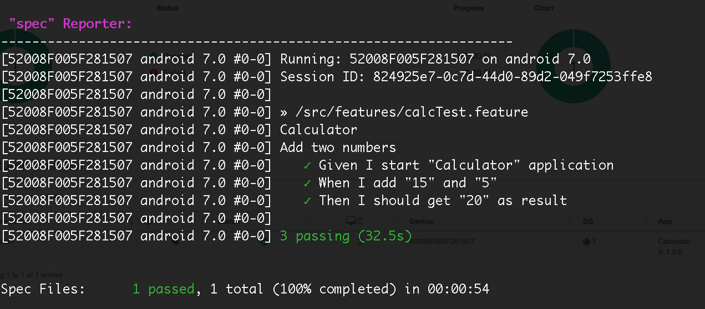
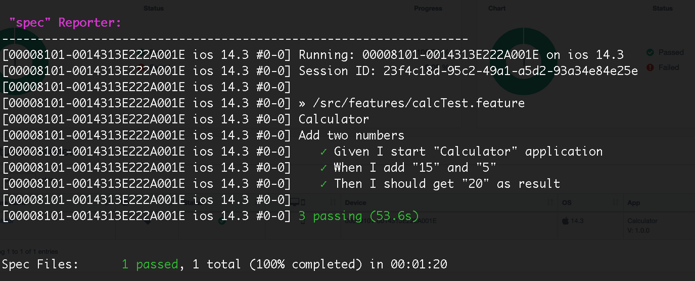

# wdio-v7-perfecto-boilerplate

Boilerplate project to run WebdriverIO tests in Perfecto Cloud ([https://www.perfecto.io/]()) using Cucumber features, and the page objects pattern.

## Requirements

- Node version 16.14 or higher
- Perfecto Cloud Access

# Frameworks:
- webdriverIO (v7)
- cucumber (v8)

# Features:
- Cloud integration with [Perfecto](https://www.perfecto.io/)
- Supports Page Object Model
- Contains sample Scenarios written in Declarative style of BDD

## Running end-to-end tests

- Clone the git repo - `git clone https://github.com/tamil777selvan/wdio-v7-perfecto-boilerplate.git`.

- Install dependencies with `npm i`.

- Update Device Capabilities and Perfecto Security Token in `.env` config file

- Run `npm run perfecto` to execute the e2e tests.

## Spec Output

Android

IOS
